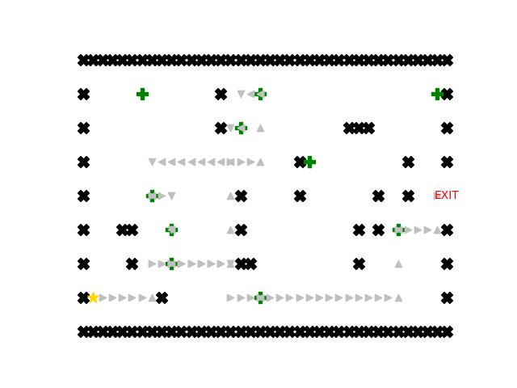

# AI_search
Đồ án môn Cơ Sở Trí Tuệ Nhân Tạo HCMUS, nội dung về các thuật toán tìm kiếm (BFS, DFS, UCS, BestFS, A-Star) với 3 bài toán khác nhau.\
Huỳnh Thiết Gia\
Ngô Phúc Hội\
Nguyễn Nhật Tiến\
Được 10 điểm, quá tuyệt vời <3.

\
